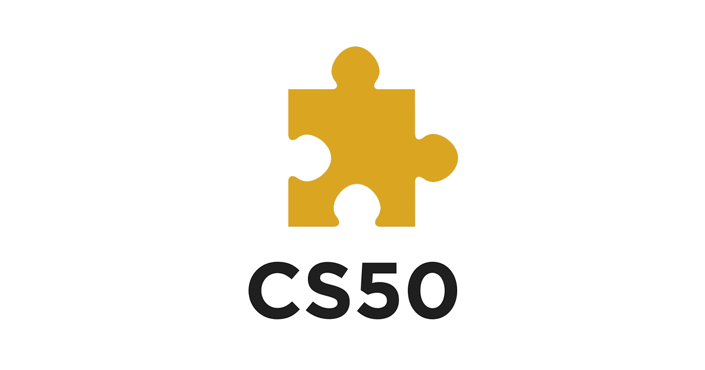

<h1> CS50's puzzle day competition</h1>

Puzzle day is an event that is hold every year at <b>Harvard University</b>, the main goal is to solve a packet of puzzles (logic problems) in teams with no programming or CS experience required to do so! 

<section>
<h2>How does it work?</h2>
<ul>
    <li>The event is open to everyone around the world, whether taking CS50 or not, thus teams are welcome to work on the puzzles online or in person (by yourselves or alongside other teams).</li>  
    <li>Puzzles will not require prior programming experience, just logic and smarts. All you'll need is a computer with Internet access, a pen or pencil, and scratch paper</li>  
    <li>CS50 certificates will be awarded to the teams that answer the most questions correctly.</li>
    <li>Start and finish dates will be available on the website</li>
</ul>
</section>

<section>

<b><i>This repository will store my answers for this event for every time that I attend, if you think that this type of thing sounds cool then you can check it out!</i></b>

</section>
